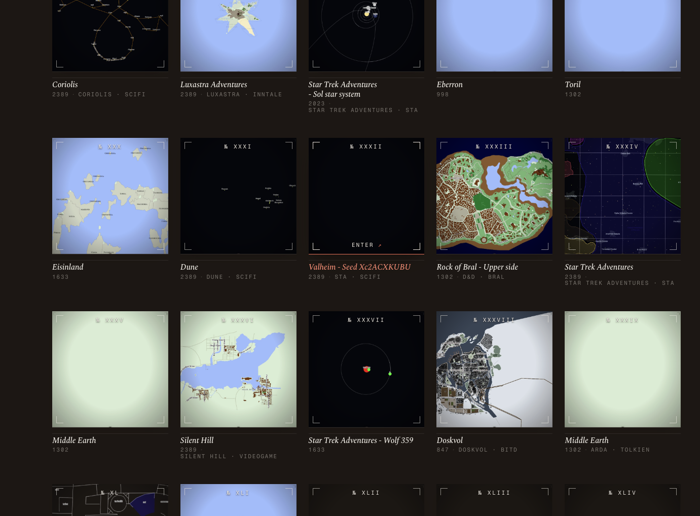
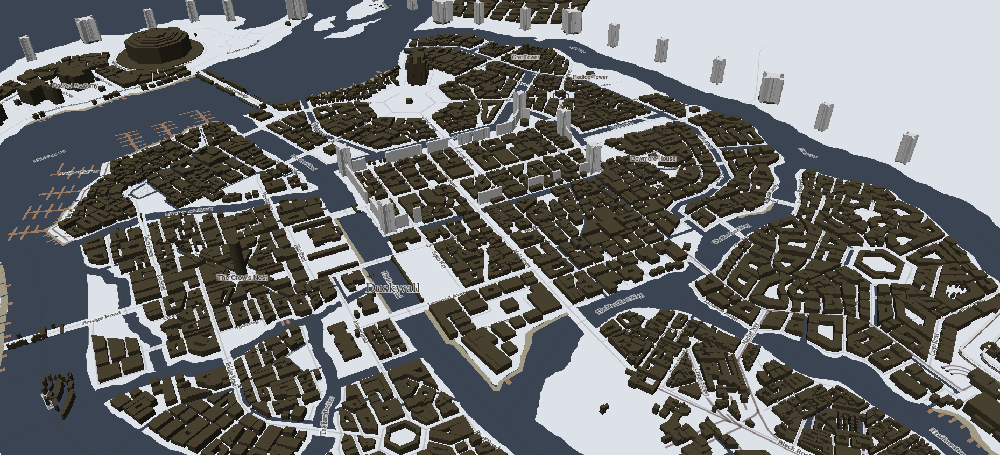
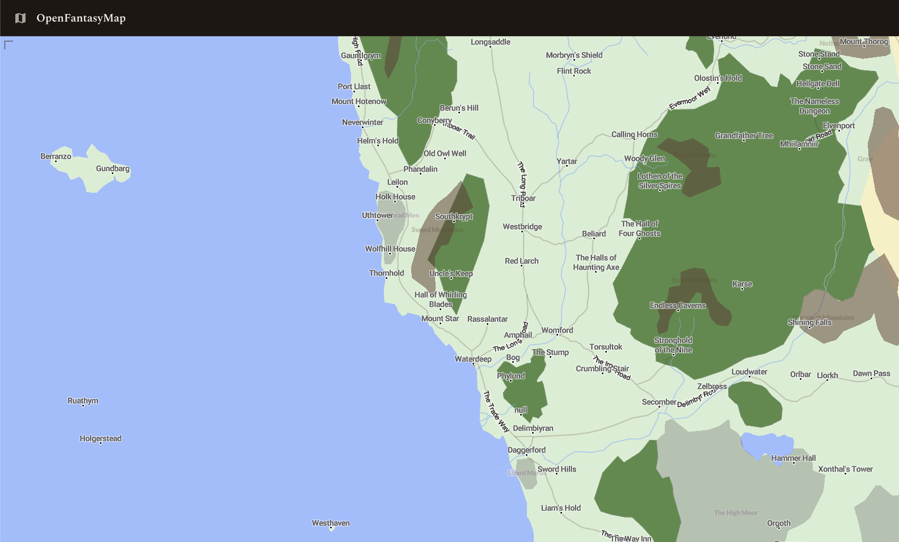

<!-- _class: lead -->
<!-- _paginate: false -->

# From Open Data to Agent-Queryable Worlds

### Building a Hospitality Layer on top of Open Data Hub APIs

**Marco Montanari - Open Fantasy Maps**
2026-05-14

<!--
Speaker notes — 10 minutes total, ~45s per slide.
Opening (this slide, ~30s): "We built a small service that lets an AI assistant
plan a fully customized South Tyrol holiday — hotels, hikes, restaurants,
events, weather — by talking to one open data source. I'll cover the problem,
how it works, a walkthrough, and where it goes next."
-->

---

## About me

- **Marco Montanari** — *Software Architect*
- Creator of **Open History Map** and **Open Fantasy Maps** — geospatial + AI for imagined worlds
  - https://www.openhistorymap.org and https://www.fantasymaps.org
- Background: *[GIS / Cloud dev / AI ]*
- Today: why I spent my time pointing an LLM at a tourism API

<!--
~25s. Keep it short and human — this is the "who's talking" slide, not a CV.
Replace the bracketed placeholders with your real role and one-line background.
The last bullet is the hook into the talk: it sounds like a detour, but the
final slide pays it off.
-->

---

## About Open Fantasy Maps

A multi-service platform for **fantasy world mapping** and tabletop gaming.

https://map.fantasymaps.org

- Geospatial APIs — map tiles, vector layers, NPC & location data
- **MCP-based AI agents** that let Claude query and reason over a world
- Interactive Mapbox-powered web apps
- Dozens of worlds: Toril, Golarion, Barovia, Coriolis, Middle-earth…

Same stack as the "real world": **PostGIS · FastAPI · MCP · LLM agents.**

<!--
~35s. The point to land: OFM is not a map drawing tool — it's an engine for
making *worlds* queryable by both people and AI agents. That last line is the
bridge: the technology under a fantasy realm and under South Tyrol is the same.
Plant that seed; the closing slide harvests it.
-->

---



<!--
~25s. Let the image breathe. This is the OFM world catalogue — Toril, Dune,
Middle-earth, Coriolis, Star Trek, Silent Hill, Rock of Bral, Valheim… Every
tile is the same engine, themed to a different reality. The point: OFM already
runs at scale across wildly different worlds. Don't enumerate — just sweep a
hand across it and say "this is what 'a world' means to us."
-->

---



<!--
~25s. Doskvol — the haunted industrial city from Blades in the Dark — rendered
in 3D by the same OFM engine: districts, canals, bridges, all from structured
world data. The point: the engine doesn't care whether a world is invented or
real. Say it here — "real or fictional, it's all just a world to us" — so the
tourism API on the next slides lands as home turf, not a detour.
-->

---



<!--
~25s. And here's the interactive product — the Sword Coast of the Forgotten
Realms, live in the OpenFantasyMap web app: named towns, regions, terrain, all
navigable. This is the punchline of the showcase run: a fantasy world served
as a real map of named places and points of interest — structurally the same
thing as a tourism dataset. Then pivot: "so — what if the places were real?"
-->

---

## The problem

Planning a trip means juggling **many separate questions**:

- Where do we sleep? (hotel? farm? mountain hut?)
- What's there to *do* — hikes, restaurants, culture?
- What's happening *while we're there* — events, markets?
- What will the *weather* be?

All that data exists — but it's spread across one large API
with **106 endpoints** and a filter syntax no traveller wants to learn.

<!--
~50s. The pain isn't lack of data — South Tyrol publishes excellent open data.
The pain is that turning it into an itinerary takes an expert who knows the API.
We want a traveller to just say "plan me 4 days near Val Gardena in June with
my family" and get a real answer. Hold the "how" — next slides.
-->

---

## What we built

A **Model Context Protocol (MCP) server** — the bridge that lets an
AI assistant (Claude) *use* the tourism data as a set of tools.

```
Traveller  →  Claude  →  Hospitality MCP server  →  Open Data Hub Tourism API
   "plan my trip"       13 planning tools          tourism.api.opendatahub.com
```

The LLM does the reasoning and synthesis.
The MCP server gives it **safe, well-described, ready-to-use tools**.

<!--
~55s. Define MCP for the mixed audience: it's the emerging standard for
connecting an LLM to external systems — think "USB port for AI tools".
We didn't build an AI. We built the part that an AI plugs into. The
intelligence is Claude; our job is to expose the tourism data in a way the
model can use reliably without hallucinating API syntax.
-->

---

## The data source

**South Tyrol Open Data Hub — Tourism API**
`tourism.api.opendatahub.com`

- Run by NOI Techpark — official open data for the region
- **106 endpoints**: accommodations, activities, events, weather, trips…
- **44,000+** points of interest alone
- Public **GET** access — no credentials, no cost
- We expose **read-only**; booking/write endpoints stay out

<!--
~45s. Emphasize: this is real, official, maintained data — not scraped.
44k POIs is a credibility number. And it's free to read. We deliberately
exposed only the read side — no write endpoints, no API keys to manage,
nothing that can charge a card. Safe by construction.
-->

---

## Architecture

| Layer | Choice | Why |
|-------|--------|-----|
| Framework | **FastMCP** (Python) | Matches the gaia_agent service in OFM |
| Transport | **Streamable HTTP** | Can be hosted as a shared remote server |
| Runtime | **Docker** (`python:3.12-slim`) | Reproducible, 212 MB image |
| API client | `httpx` async | Single pooled connection |

Served at `http://<host>:8750/mcp` — point any MCP client at it.

<!--
~50s. Keep this light for non-technical folks: "standard tools, containerized,
runs anywhere". For the engineers: FastMCP because it's what gaia_agent already
uses; streamable HTTP rather than stdio so it can be a shared service, not a
per-laptop process. Everything runs in Docker — one command to start.
-->

---

## The toolkit — 13 tools

**Discovery & location**
`resolve_location` · `list_filter_options` · `list_tags`

**Search the offer**
`search_accommodations` · `search_activities_and_pois`
`search_events` · `search_trips` · `search_articles` · `search_venues`

**Detail & context**
`get_detail` · `check_accommodation_availability` · `get_weather_forecast`

**Escape hatch**
`raw_api_call` — any other endpoint, when the curated tools don't fit

<!--
~55s. Don't read all 13. Group them: tools to figure out *where*, tools to
*search* the offer, tools to get *detail and context*, and one escape hatch.
The escape hatch is a deliberate design choice — covered two slides on.
-->

---

## Key design choice #1 — curated, not raw

We could have exposed all 106 endpoints as one generic pass-through.
We didn't.

- **13 hand-tuned tools** with plain-language descriptions
- Bitmask filters explained *in the tool itself*
  (`typefilter: 1=Hotel 2=B&B 4=Farm 8=Camping…`)
- The LLM picks the right tool — it doesn't reverse-engineer an API

➕ **`raw_api_call`** keeps 100% coverage for the rare edge case

<!--
~55s. This is the heart of the engineering judgment. A thin proxy is less work
but pushes the burden onto the model — it has to know the API. Curated tools
encode the expertise once, so every query benefits. The escape hatch means we
gave up nothing in coverage. "Curated + raw" was a conscious tradeoff.
-->

---

## Key design choice #2 — built for an LLM

**Location resolution is a first-class step**
The API filters by opaque IDs, not names. `resolve_location` turns
*"Val Gardena"* → a ready-to-use filter token. The model never guesses IDs.

**Responses are kept compact**
Curated field projections + null-stripping → small, readable payloads
→ lower token cost, faster, less noise for the model.

<!--
~50s. Two things that matter when the *consumer* is an LLM, not a human dev.
One: never make the model invent an identifier — give it a tool to look it up.
Two: token economy. Raw API responses are huge; we trim to the fields that
matter by default, overridable when more detail is needed. Cheaper and sharper.
-->

---

## Walkthrough — "4 days near Val Gardena, family, June"

1. `resolve_location("Val Gardena")` → region filter token
2. `search_accommodations` — family hotels, half-board → **8 hotels**
3. `search_activities_and_pois` — easy hikes + gastronomy → **62 places**
4. `search_events` — June window → **17 events**
5. `get_weather_forecast` → 3-municipality forecast
6. `get_detail` on the traveller's picks → full info to book

The LLM weaves these into a day-by-day itinerary.

<!--
~60s. This is the demo narrative — walk it as a story. Each step is one tool
call; the model chains them. Note the numbers are real (next slide). End with:
"the model is the travel agent; our tools are its reference desk."
-->

---

## It works — verified against live data

End-to-end MCP client calls against the running container:

- ✅ Resolved *Val Gardena* → region token
- ✅ **8** family hotels · **62** gastronomy & activity POIs
- ✅ **17** events in June · 3-municipality weather forecast
- ✅ **28** ski areas via the raw escape hatch
- ✅ **71** accommodation filter options discovered

All 13 tools registered and returning real data.

<!--
~45s. Proof, not promises. We didn't just write code — we ran a real MCP client
against the Docker container and confirmed every tool returns live data. These
are the actual numbers from the test run.
-->

---

## Run it

```bash
docker compose up -d --build
# server live at http://<host>:8750/mcp
```

Configurable via `.env`: language, port, API base URL.
Point Claude (or any MCP client) at the endpoint — done.

**Code:** `github.com/openfantasymap/hospitality-mcp`

**Next steps**
- Caching layer (forecasts, filter options) to cut API calls
- `check_accommodation_availability` against a real booking channel
- Optional: itinerary-export tool (PDF / calendar)

<!--
~45s. One command to run. Then where it goes: caching is the obvious win —
filter options and forecasts don't change often. Availability check currently
hits the public channel; wiring a real booking partner is the path to an
actual bookable trip. Itinerary export would close the loop for the traveller.
-->

---

## But how does that connect to the fantasy maps?

This whole exercise **is** an OFM pattern — stress-tested on real-world data.

- OFM turns a *world's* geospatial data into **agent-queryable tools**
- South Tyrol is just another "world": real, large, gloriously messy open data
- ODH has a beautiful OpenAPI for localized hospitality info
- The flow is **identical** —
  *resolve a place → search what's there → get detail → an LLM plans the journey*
- A traveller planning Val Gardena ≈ a GM planning a 3-day trek on Riza or through the Thay mountains

If the pattern survives **106 endpoints** of real open data,
it will carry a fantasy realm with room to spare.

<!--
~60s — the payoff slide, slow down here. The "weekend detour" from the About-me
slide lands now: this wasn't a side project, it was a proving ground. The MCP +
geospatial + LLM pattern is exactly what OFM runs on fantasy worlds. Real open
data is harder than our own clean datasets — 106 endpoints, opaque IDs, bitmask
filters — so if Claude can plan a holiday here, it can guide a party through
Toril. Same architecture, different world.
-->

---

<!-- _class: lead -->

# Thank you

**OFM — Hospitality MCP**
13 tools · open data · Dockerized · LLM-ready

**`github.com/openfantasymap/hospitality-mcp`**

Questions?

<!--
~20s. Wrap: "A small, focused server that turns a 106-endpoint API into
something an AI can actually plan a holiday with. Happy to dig into any of it."
Leave time for Q&A.
-->
